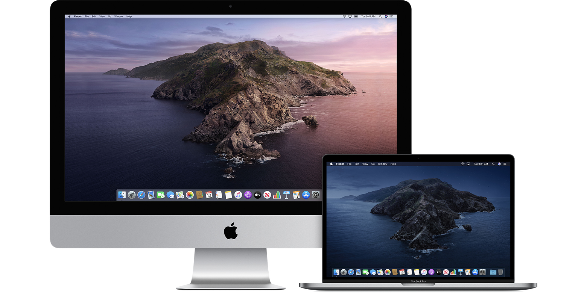
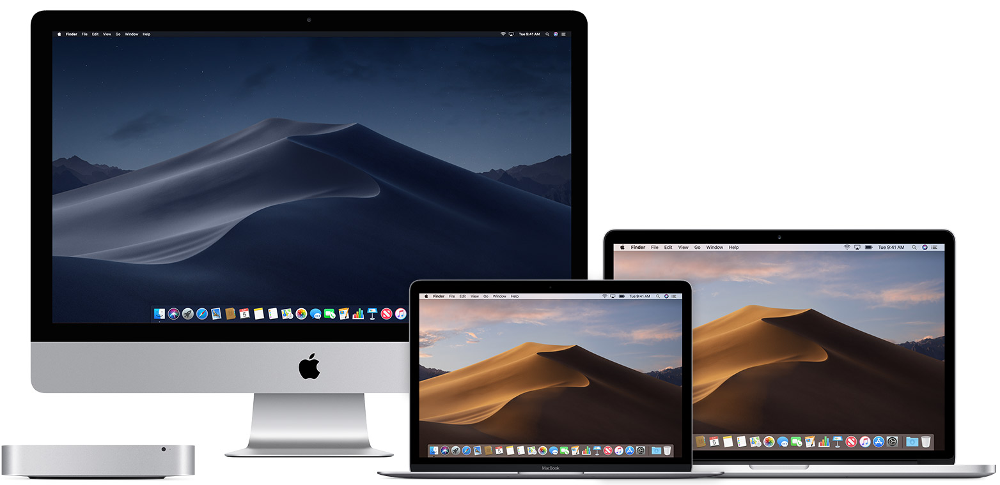
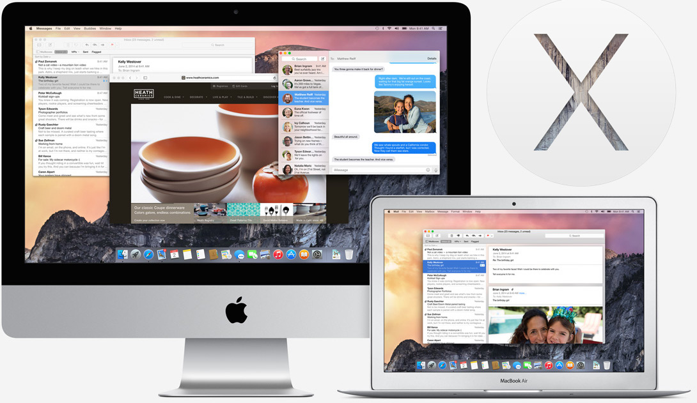

# Introducción al desarrollo en iOS
No es raro ver teléfonos o productos de la manzana mordida en las calles, empresas y en casas. Por muchos años se ha mantenido como una de las principales competencias de Google, Microsoft, Huawei y Samsung.

Apple se focaliza más en la experiencia de usuario, tanto en hardware como en software, por lo que el nivel de exigencia hacia los desarrolladores en iOS es más que en Android, para mantener los estándares que espera Apple para sus clientes, garantizando así aplicaciones y productos de una gran calidad. A la par, la rentabilidad de desarrollar apps es mayor en el mundo Apple que en el mundo Google.

## El sistema operativo iOS

iOS es un sistema operativo móvil que se utiliza para los disposivos iPhone y iPod. Recientemente iPad cambió de poseer el sistema iOS a tener una versión distinta llamada iPadOS, con características específicas para sacar partido a un iPad. 

### Versiones

Actualmente tenemos la versión 13.3 (Esperemos que para el 6 de Enero esa sea xd, si no sería 13.2.3).
Existe por tanto versiones desde
iPhone OS 1.0, iPhone OS 2.0, iPhone OS 3.0 y luego iOS 4 hasta el 12, y ahora iOS 13.

Podríamos mencionar todas las versiones de iOS pero solo se muestran las últimas características en **iOS 13**. 

[Anexo: Historial de versiones de iOS](https://es.wikipedia.org/wiki/Anexo:Historial_de_versiones_de_iOS)

### Características

- Dark Mode
- Sign in with Apple
- Maps con vista tipo StreetView
- ARKit 3: Mejoras en realidad aumentada.
- Conexión de 2 airpods
- CoreML 3: Mejoras en proyectos de machine learning
- Deslizar en teclado para escribir
- Mejoras en CarPlay
- Voice Control
- Manejador de fuentes
- Nuevos Animojis
- Mejoras en HomeKit

### Kernel
Desde la primera versión de iOS, utiliza algo llamado XNU (X is Not Unix). Es le mismo kernel que utiliza Darwin, el sistema operativo libre de Apple y en el cuál se basa iOS.

- iOS 4 - Darwin 10
- iOS 5 - Darwin 11
- iOS 9 - Darwin 15

**Cualquiera puede descargar el código fuente de XNU, incluso de Darwin. Es OpenSource.**

[Código del núcleo de iOS](https://opensource.apple.com/source/)

[Open Source Apple](https://opensource.apple.com)

## El sistema operativo macOS

De la misma manera otro sistema operativo que estaremos usando en el curso será macOS, recientemente renombrado de OS X. Actualmente nos encontramos en macOS 10.15 que lleva por sobrenombre Catalina, que hace referencia a la isla californiana Catalina.

### Versiones

Las últimas versiones del sistema operativo tienen de sobrenombre de lugar naturales atractivos en california y contiene un fondo de pantalla de dichos lugares por defecto. 

- 10.14: macOS Mojave

- 10.13: High Sierra

- 10.12: Sierra

- 10.11: El Capitán

- 10.10: Yosemite

- 10.9 Mavericks

Anteriormente eran nombres de felinos como Lion, Mountain Lion, Leopard, Panther, Jaguar, etc.

### Características

Las versiones de macOS contienen diferentes características que se implementaron conforme se actualizaban. Actualmente Catalina ofrece las siguientes:

- Separación de iTunes en Music, Podcasts y Apple TV.
- Actualización a Safari, el navegador por defecto en macOS
- Sidecar: Usa tu iPad como segunda pantalla, puedes usar Apple Pencil para programas como Photoshop o Ilustrator
- ScreenTime para medir el tiempo que usas tu Mac y en qué.
- Incremento en la seguridad
- Implementación de Find My, para encontrar y recuperar tus dispositivos.
- Voice Control

[Checa todas las nuevas funcionalidades de macOS Catalina](https://www.apple.com/mx/macos/catalina/features/)

[Checa todas las implementaciones en las versiones de macOS y OSX](https://es.wikipedia.org/wiki/MacOS#Versiones)

