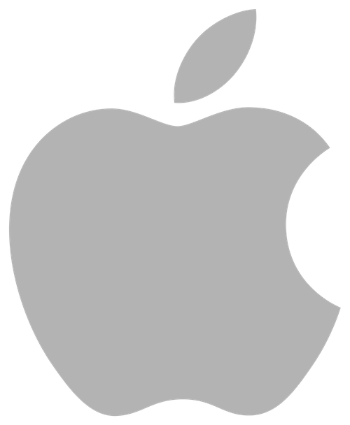
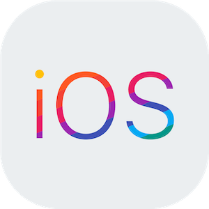
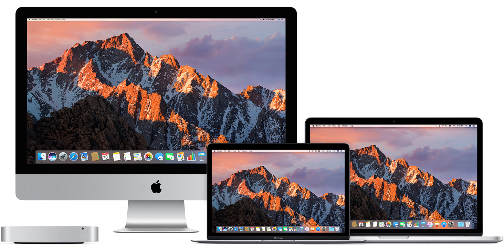
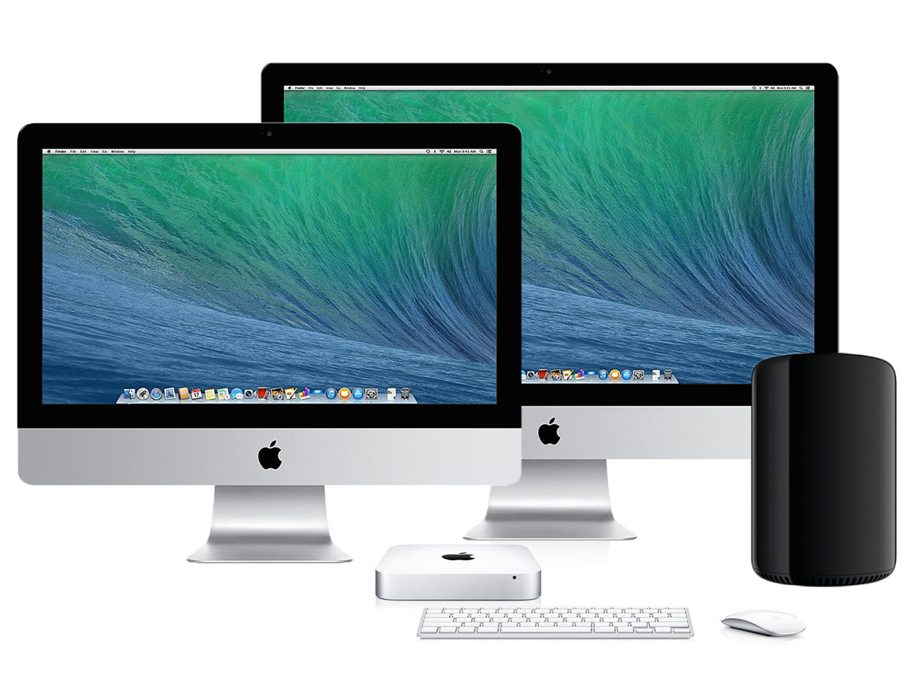
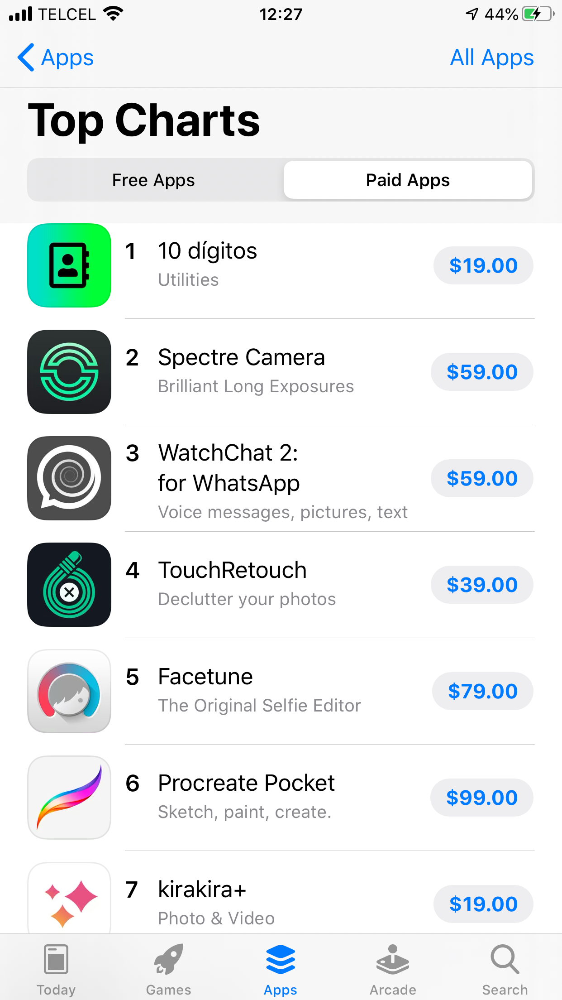
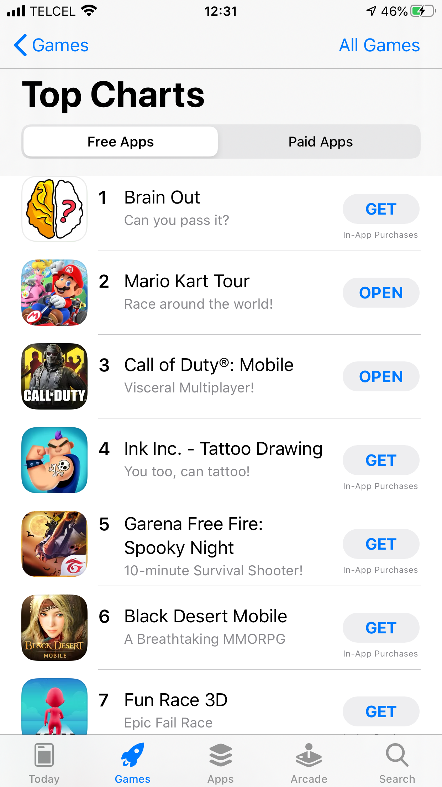
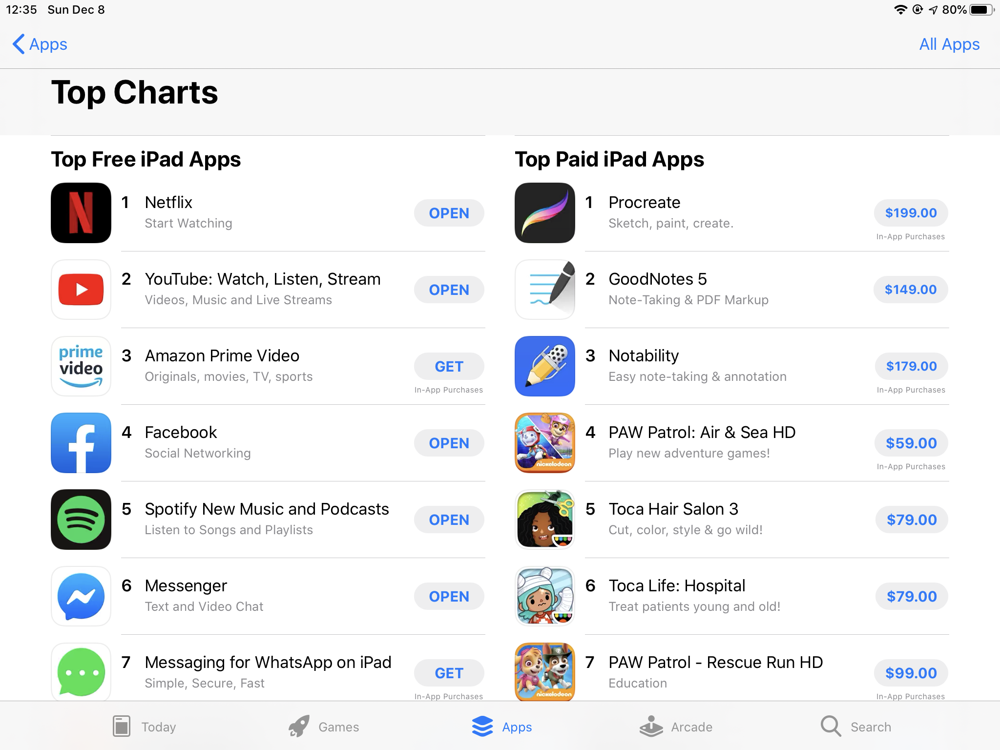

<p>
  
</p>

# Introducción al desarrollo en iOS
No es raro ver teléfonos o productos de la manzana mordida en las calles, empresas y en casas. Por muchos años se ha mantenido como una de las principales competencias de Google, Microsoft, Huawei y Samsung.

Apple se focaliza más en la experiencia de usuario, tanto en hardware como en software, por lo que el nivel de exigencia hacia los desarrolladores en iOS es más que en Android, para mantener los estándares que espera Apple para sus clientes, garantizando así aplicaciones y productos de una gran calidad. A la par, la rentabilidad de desarrollar apps es mayor en el mundo Apple que en el mundo Google.

<p>
  

</p>

## El sistema operativo iOS


iOS es un sistema operativo móvil que se utiliza para los disposivos iPhone y iPod. Recientemente iPad cambió de poseer el sistema iOS a tener una versión distinta llamada iPadOS, con características específicas para sacar partido a un iPad. 

### Versiones

Actualmente tenemos la versión 13.3 (Esperemos que para el 6 de Enero esa sea xd, si no sería 13.2.3).
Existe por tanto versiones desde
iPhone OS 1.0, iPhone OS 2.0, iPhone OS 3.0 y luego iOS 4 hasta el 12, y ahora iOS 13.

Podríamos mencionar todas las versiones de iOS pero solo se muestran las últimas características en **iOS 13**. 

[Anexo: Historial de versiones de iOS](https://es.wikipedia.org/wiki/Anexo:Historial_de_versiones_de_iOS)


### Características

- Dark Mode
- Sign in with Apple
- Maps con vista tipo StreetView
- ARKit 3: Mejoras en realidad aumentada.
- Conexión de 2 airpods
- CoreML 3: Mejoras en proyectos de machine learning
- Deslizar en teclado para escribir
- Mejoras en CarPlay
- Voice Control
- Manejador de fuentes
- Nuevos Animojis
- Mejoras en HomeKit

### Kernel
Desde la primera versión de iOS, utiliza algo llamado XNU (X is Not Unix). Es le mismo kernel que utiliza Darwin, el sistema operativo libre de Apple y en el cuál se basa iOS.

- iOS 4 - Darwin 10
- iOS 5 - Darwin 11
- iOS 9 - Darwin 15

**Cualquiera puede descargar el código fuente de XNU, incluso de Darwin. Es OpenSource.**


[Código del núcleo de iOS](https://opensource.apple.com/source/)

[Open Source Apple](https://opensource.apple.com)

<p>
  

</p>

## El sistema operativo macOS

De la misma manera otro sistema operativo que estaremos usando en el curso será macOS, recientemente renombrado de OS X. Actualmente nos encontramos en macOS 10.15 que lleva por sobrenombre Catalina, que hace referencia a la isla californiana Catalina.


### Versiones

Las últimas versiones del sistema operativo tienen de sobrenombre de lugar naturales atractivos en california y contiene un fondo de pantalla de dichos lugares por defecto. 

- 10.14: macOS Mojave


- 10.13: High Sierra


- 10.12: Sierra




- 10.11: El Capitán


- 10.10: Yosemite


- 10.9 Mavericks



Anteriormente eran nombres de felinos como Lion, Mountain Lion, Leopard, Panther, Jaguar, etc.


### Características

Las versiones de macOS contienen diferentes características que se implementaron conforme se actualizaban. Actualmente Catalina contiene:

- Separación de iTunes en Music, Podcasts y Apple TV.
- Actualización a Safari, el navegador por defecto en macOS
- Sidecar: Usa tu iPad como segunda pantalla, puedes usar Apple Pencil para programas como Photoshop o Ilustrator
- ScreenTime para medir el tiempo que usas tu Mac y en qué.
- Incremento en la seguridad
- Implementación de Find My, para encontrar y recuperar tus dispositivos.
- Voice Control


[Checa todas las nuevas funcionalidades de macOS Catalina](https://www.apple.com/mx/macos/catalina/features/)

[Checa todas las implementaciones en las versiones de macOS y OSX](https://es.wikipedia.org/wiki/MacOS#Versiones)

### Shortcuts o atajos de teclado

Seguramente recuerdas de Windows que CONTROL + C es copiar, CONTROL + V es pegar, CONTROL + G es guardar y así sucesivamente. En macOS contamos con dichos atajos pero distribuidos de diferente manera. 

Por lo primero que debe saltar a tu vista es que en el teclado Mac hay una tecla que dice cmd, otra alt, otra con una flecha para arriba (Shift), otra ctrl y otra por ahí que dice fn. Bueno, el catálogo de atajos vienen con la siguiente metodología:

- **cmd ⌘** + algo indica que ejecutarás una acción, ejemplo: cmd + c = copiar
- **alt** + algo indica que insertarás el caracter a la derecha del la tecla que vayas a presionar, ejemplo: cmd + 2 = @
- **shift** + algo indica que podrás mayúsculas o si presionas un número pondrá el símbolo en la parte superior de la tecla, ejemplo: shift + a = A, shift + 5 = %

### Kernel - Basado en Unix
XNU es un núcleo o kernel desarrollado originalmente por NeXT e implementado por Apple Inc. en 1996 en su sistema operativo macOS. XNU es el acrónimo de "X is Not Unix". Fue liberado como software libre y de código abierto como parte del sistema operativo Darwin. Lo que quiere decir que si eres usuario de alguna distribución de GNU/Linux te sentirás familiar con el sistema, además que la terminal para términos prácticos y profesionales te permitirá tener una transparencia con Linux. Es como tener ambos mundos: GNU/Linux y software privativo desarrollado para Mac (dmg).

### Homebrew

**Este apartado es importante, no solo para el curso de iOS**. Si has utilizado GNU/Linux alguna vez habrás escuchado la palabra sistema de gestor de paquetes. En macOS se cuenta con ello también, para poder instalar componentes extras a nuestro ordenador. 


En escencia para instalar **Python, PHP nativo, MySQL**, y entre más cosas como kits para desarrollar entre otras podrán ser descargadas solo con el comando:


```console
MacBook-Pro-de-Sam:~$ brew install <Lo que quieras instalar>
```

Para poder instalar homebrew necesitarás colocar ésto en tu terminal. Lo usaremos mucho en éste curso y lo usarás mucho si serás desarrollador en general.

```console
MacBook-Pro-de-Sam:~$ /usr/bin/ruby -e "$(curl -fsSL https://raw.githubusercontent.com/Homebrew/install/master/install)"
```

<p>
  

</p>

## App Store (iOS y iPadOS) y Mac App Store

Sonará redundante pero sí, las tiendas de aplicaciones para dispositivos móviles tales como iPad, iPhone, iPod, Apple Watch están separadas de las tiendas para Mac y no tan notorio pero es diferente desarrollar para las 4 categorías:

- Apple Watch
- iPhone, iPad e iPod
- Mac
- AppleTV

Esto ya que éstos 4 dispositivos cuentan con sistemas operativos distintos. Son muy compatibles entre sí pero son distintos.

**Cabe destacar que por ello es la fiebre Apple, todos los dispositivos interactúan entre sí de una manera muy transparente. Las llamadas que llegan a tu teléfono también llegan a tu Mac o iPad o iPod, tus archivos siempre se encuentran en todos los dispositivos y mucho más, parece como si un dispositivo fuera la extensión del otro.**

### Tendencias

Solo basta abrir la tienda de aplicaciones en su dispositivo para ver las tendencias. Dentro de la App Store encontraremos una nueva sección especializada en juegos ya que reporte de ingresos muestran que **41% de ingresos de desarrollo de Apps vienen de los juegos**.


#### iPhone
Las aplicaciones más populares son redes sociales, juegos y servicios como Uber o aplicaciones bancarias como BBVA. Dentro de las aplicaciones hay 2 categorías, las gratis y las de paga.
<p>
  
  
</p>

Y los juegos del momento son:
<p>
  
  
</p>
#### iPad

Como el iPad es usado más para 4 grandes cateorías: juegos, notas, ocio y algunos productividad tendremos éstas:



Y los juegos (que la mayoría son los que los padres descargan para niños):


**Fuera de eso, no les recomendaría desarrollar a menos que tengan un buen motivo.😕**

## Recomendaciones para crear sus apps

Como se había dicho al principio, Apple es muy selectiva con sus aplicaciones ya que busca mejorar en la medida de los posible la experiencia de usuario, por lo que tendremos que cuidar mucho el diseño de la misma, que sea intuitiva de usar y que tenga los elementos suficientes, que todos los botones o elementos tengan un motivo (que no haya botones que los presiones y no haga nada por ejemplo), usar todo el tamaño de la pantalla, etc.

También si agregamos algunos de los servicios que brinda Apple como hacer Siri compatible con nuestra app suman puntos, o que tenga la función de continuidad, que al pasar de dispositivo puedas continuar tu trabajo igual, puntos extra.

**Si desarrollas una app con todas las herramientas que Apple ofrece para los desarrolladores, para explotar las funcionalidades del dispositivo al máximo podrías recibir ayuda con la propaganda en la App Store e incluso ganar uno de los premios llamado: Apple Design Awards que premia a las mejores Apps con muchos premios y publicidad gratis.**

Entre los premios está un bonche de productos Apple tope de gama como iMac, Macbook Pro, iPhone, iPad, Apple Watch y más en sus versiones más equipadas y más costosas.


