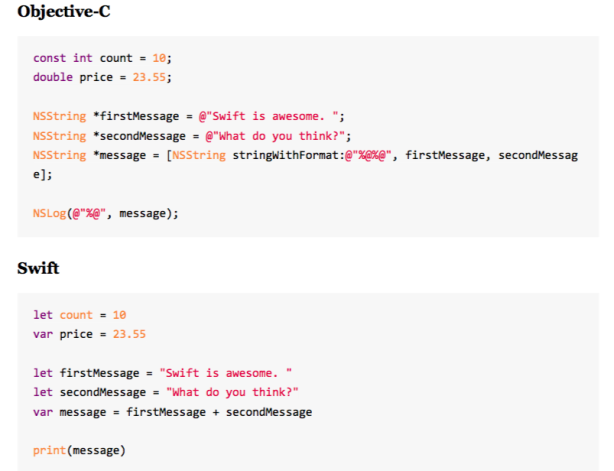
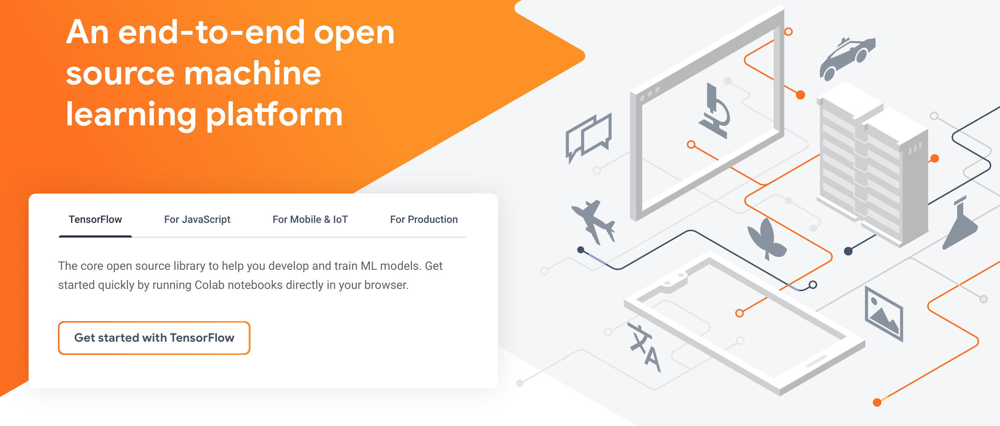

# Desarrollo en plataforma iOS

## Xcode

El desarrollo de aplicaciones se hará a través de un programa llamado Xcode, disponible en la Mac App Store o descargas desde la página de desarrolladores de Apple. También podrás programar en C aquí pero no lo recomiendo.

Antes que nada, es necesario que te crees una cuenta iCloud de Apple (como en Play Store que necesitas correo Gmail para poder descargar apps), iniciar sesión y podrás descargar Xcode. **Guarda ésta cuenta que desde ahora te servirá para todo, tu cuenta de desarrollador**.

Una vez descargado, si lo abres la primera vez verás una ventana parecida a ésta:

**Xcode incluye además, simuladores de dispositivos, por lo que no será necesario contar un iPhone o iPad para probar tus apps, se recomienda tenerlo para pruebas mayores pero no es necesario actualmente**

## Playgrounds

Si en la imagen anterior notaste que hay 3 botones que dicen:

- Get started with a playground
- Create a new Xcode project
- Clone existing project

El primero hace referencia a lo que hablaremos: Playgrounds.
Playgrounds es a vil de cuentas una hoja de texto (como sublime) pero con herramientas extras para hacer pruebas, como dice el nombre, jugar con el lenguaje de programación que se usa para desarrollar en iOS: Swift.

Picando el primer botón y obteniendo un playground podrás aprender todo lo referente a la sintaxis de la programación, incluso desarollar aplicaciones de realidad aumentada con sólo código. Es nuestro cajón de arena para aprender Swift.

Un playground luce así:

  

## El lenguaje de programación Swift

Dicen las malas lenguas que trabajar antes en desarrollo iOS era muy complejo y la razón, dicen muchos era el lenguaje de programación: Objective-C. Aquí es donde entra Swift en escena.

Swift es un lenguaje de programación multiparadigma creado por Apple enfocado en el desarrollo de aplicaciones para iOS y macOS. Fue presentado en WWDC 2014 y está diseñado para integrarse con los Frameworks Cocoa y Cocoa Touch, puede usar cualquier biblioteca programada en Objective-C y llamar a funciones de C. También es posible desarrollar código en Swift compatible con Objective-C bajo ciertas condiciones. Swift tiene la intención de ser un lenguaje seguro, de desarrollo rápido y conciso. Fue presentado como un lenguaje propietario, pero en el año 2015, con la versión 2.2 pasó a ser de código abierto.

Swit facilita la comprensión de código mediante una sintaxis tan amable como Python, además de diversos agregados como los llamados "Azúcar sintáctico" que son palabras agregadas al código para que la comprensión del mismo sea como leer un libro o un manual de acciones.

**Juzgue usted mismo**

**Rendimiento**

Hay que entender un concepto clave: entre más humano sea el lenguaje, más tiempo tarda la computadora para entenderlo mientras es traducido, y viceversa, si tenemos un código objeto, para la computadora es directamente hablarle en 0 y 1's pero para nosotros leer eso es un caos total. Por ello la gráfica siguiente:

Los lenguajes de programación como Java, C++, C, Objective-C son muy agresivos y con una curva de aprendizaje muy elevada pero tienen un rendimiento muy superior a cualquier otro lenguaje por lo cercano a ser código máquina. En cambio lenguajes como Python, Ruby, Perl, JS son más comprensibles y más sencillos de aprender pero para desarrollo de cosas pesadas o que el tiempo es lo más vital, el rendimiento les falla por todas las traducciones hasta llegar a código máquina. 

Swift promete contener lo mejor de ambos mundos. Tener una sintaxis amable con el usuario y sin comprometer al preformance. Es más, es 2.6x más rápido que Objective-C.

Tanto así que existe por ahí un proyecto de un Framework para desarrollo de redes neuronales llamado **TENSORFLOW**

Los que hayan trabajado con desarrollo de inteligencia artificial, machine learning, y conceptos de ciencia de datos conocerán este magno proyecto ofrecido por Google.

### TensorFlow (paréntesis)

(Haz click en la imagen)

TensorFlow es una biblioteca de Python que te permitirá contruir modelos predictivos con redes neuronales de una manera rápida, eficiente y con alto potencialidad de escalabilidad. Muchos proyectos en el mundo está usando ésta biblioteca de Python para cosas desde **analizar textos antiguos del archivo vaticano, hasta predecir condiciones extremas del clima.**

Utiliza Python como principal lenguaje pero Python carga consigo un pecado: Es un lenguaje interpretado, lo que quiere decir que no genera un archivo compilado(un archivo en código objeto), sino que va traduciendo línea por línea en tiempo real. Así que sacrifica el rendimiento que podría tener tratándose del análisis de bancos de datos enormes.

Aquí entra Swift, que fue elegido como el reemplazo que ésta biblioteca tendrá para potencializar el rendimiento del desarrollo de modelos predictivos. Así que Swift al ser compilado, de una sintaxis amable y con un rendimiento impresionante se ha ganado ese puesto. Podemos decir que Swift no solamente sirve para hacer aplicaciones móviles, puede ser llevado a muchas otras cosas y muy interesantes.

### ¿Entonces, qué opinas de Swift?

Próximamente: Curso de TensorFlow ❤️