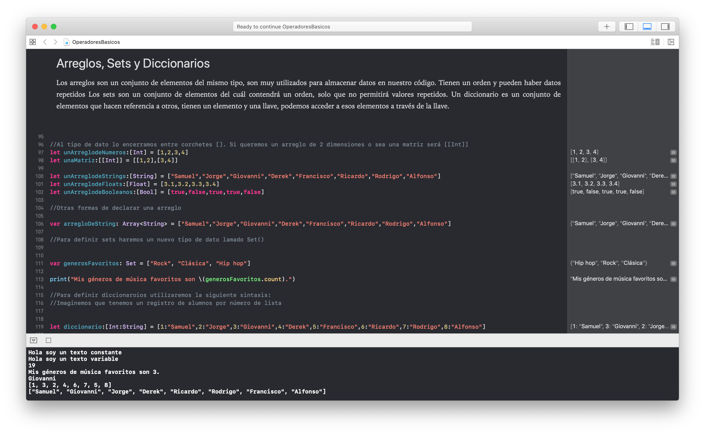

# Operaciones básicas en Swift 🐥
 
 **Primero antes que nada, recuerda que todo se trata de aprender así que si algo no me di a entender puedes mandarme un correo. 🐶**
 
 
Primero antes que nada, como concepto primordial en Swift es que existen 2 tipos de datos: los constantes **let** y las variables **var**. Si declaramos una variable como tipo let, no podremos cambiar su valor más adelante, contrario de var que podremos cambiar el valor de la variable cuantas veces necesitemos.

Para imprimir valores como en los otros lenguajes de programación usaremos la siguiente función: **print(loQueQueramosImprimir).**


```swift
// <- Con doble barra hacemos comentarios en el texto

let holaMundo = "Hola mundo!" //Para que no caiga la maldición

let miConstante = "Hola soy un texto constante"

var miVariable = "Hola soy un texto variable"
print(holaMundo)
print(miConstante)
print(miVariable)
```
Primero, Swift contiene algo llamado inferencia de dato, que nos permite colocar una variable seguido de lo que contenga sin necesidad de decirle que es un entero, una cadena o un booleano. A esto lo llamamos declaración implícita.

Podemos igual hacer declaraciones explícitas, poniendo dos puntos seguido del tipo de dato. Es recomendable hacer esto para ahorrarle trabajo a la computadora a la hora de compilar el código.

```swift
//Implícita, Swift infiere el tipo de dato
var numero1 = 9

//Explícita, tu defines el tipo de dato
var numero2:Int = 10


```


## Tipos de datos 🦁

 Tendremos diferentes tipos de datos como:
 
- **Int** - Enteros
- **Float** - Decimales no tan precisos, menos gasto de memoria
- **Double** - Decimales muy precisos, más gasto de memoria
- **String** - Cadenas de texto
- **Bool** - Booleano, solo puede tener valores true o false, 0 o 1
- **Character** - Un caracter
 
```swift
let unEntero:Int = 1
let unFlotante:Float = 3.1416
let unDouble:Float = 3.14159265358979323846264338327950288419716939
let unString:String = "Te pago el Uber"
let unBooleano:Bool = true
let unCaracter:Character = "F"

// Operaciones matemáticas

let numeroPrimero:Int = 1
let numeroSegundo:Int = 2

print(numero1+numero2)

5+10
10-5
4*10
5/2

```

Para obtener la potencia y la raíz cuadrada de un número, tendremos que importar una biblioteca (veremos más adelante qué es) para poder usar éstas funciones (que igual veremos más adelante).


```swift
//Importamos la biblioteca de Foundation
import Foundation

pow(10,2) // Función para potencia de un número
sqrt(90) // Función para la raíz de un número

abs(-9) // Función para obtener el valor absoluto de un número

max(10,20,500,180,4,78) // Obtener el mayor de los números
min(124,62,73,5,123,9) // Obtener el menor de los números

```


## Arreglos, Sets y Diccionarios 🦊

Los arreglos son un conjunto de elementos del mismo tipo, son muy utilizados para almacenar datos en nuestro código. Tienen un orden y pueden haber datos repetidos.

Los sets son un conjunto de elementos del cuál contendrá un orden, solo que no permitirá valores repetidos.

Un diccionario es un conjunto de elementos que hacen referencia a otros, tienen un elemento y una llave, podemos acceder a esos elementos a través de la llave.


Para definir a un arreglo, al tipo de dato lo encerramos entre corchetes []. Si queremos un arreglo de 2 dimensiones o sea una matriz será por ejemplo: [[Int]].

```swift
let unArreglodeNumeros:[Int] = [1,2,3,4]
let unaMatriz:[[Int]] = [[1,2],[3,4]]


let unArreglodeStrings:[String] = ["Samuel","Jorge","Giovanni","Derek","Francisco","Ricardo","Rodrigo","Alfonso"]
let unArreglodeFloats:[Float] = [3.1,3.2,3.3,3.4]
let unArreglodeBooleanos:[Bool] = [true,false,true,true,false]


//Otras formas de declarar una arreglo

var arregloDeString: Array<String> = ["Samuel","Jorge","Giovanni","Derek","Francisco","Ricardo","Rodrigo","Alfonso"]

```


Para definir sets lo siguiente, escribiremos Set como "tipo de dato".

```swift
var generosFavoritos: Set = ["Rock", "Clásica", "Hip hop"]
print("Mis géneros de música favoritos son \(generosFavoritos.count).")

```

Para definir diccionaroios utilizaremos la siguiente sintaxis:

Imaginemos que tenemos un registro de alumnos por número de lista

```swift
let diccionario:[Int:String] = [1:"Samuel",2:"Jorge",3:"Giovanni",4:"Derek",5:"Francisco",6:"Ricardo",7:"Rodrigo",8:"Alfonso"]
```

Si quiero saber la persona de la lista número 3 basta con la siguiente expresión

```swift
print(diccionario[3]!)
```


Para poder imprimir todos los valores o todas las llaves usaremos las siguientes instrucciones

```swift
print(diccionario.keys) //imprime en un arreglo todas las llaves (los números de lista).
print(diccionario.values) //imprime en un arreglo todos los valores disponibles en el diccionario, o sea los nombres de los alumnos.
```

**Se han preguntado por qué agregué un signo ! a diccionario[3] !  -> Se verá más adelante en Optionals**



