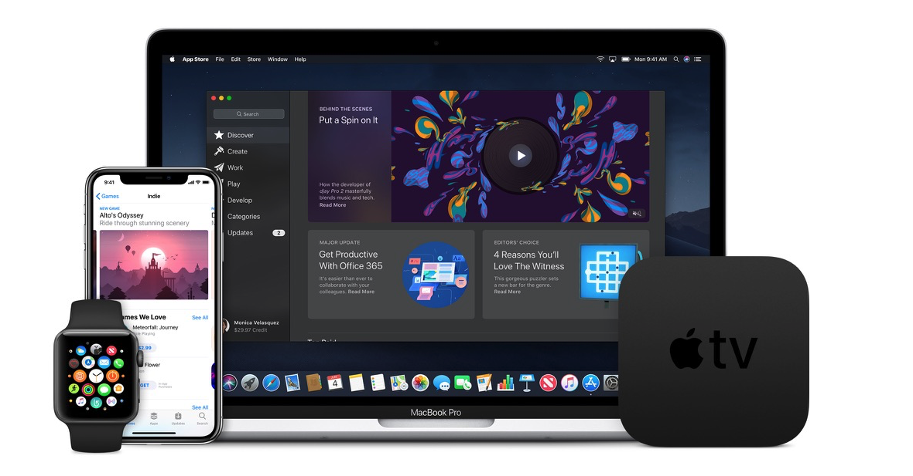

  

# Programación de Apps en iOS con Swift 

## iOS, iPadOS y macOS

En los últimos años iOS (recientemente integrando igual a iPadOS) tan tomado demasiado auge en el mundo móvil, ya sea por la estrategia de marketing que sigue Apple para sus consumidores, la experiencia de usuario que ofrece el sistema operativo o hasta razones nacionalistas, iPhone y iPad tienen un gran segmento en el mercado internacional.

Apple reconoce que sus productos no serían tan exitosos sin el mundo de desarrolladores que han creado diversas aplicaciones, que han llevado a otro nivel a la produtividad, el ocio o la socialización. 

El desarrollo de aplicaciones para el entorno Apple suele ser mejor remunerado que en Android, pero de la misma manera la exigencia hacia los desarrolladores para crear mejores experiencias de usuario es más que en la plataforma de Google, resultando en mejor calidad de aplicaciones.

En mercados americanos y canadienses iOS se levanta como el sistema operativo que más utiliza la población y por tanto a mayor cantidad de usuarios se puede llegar.

Además sus ordenadores por contener un kernel tipo Unix permite tener lo mejor del mundo Linux junto con software privativo como los Adobe (Photoshop) o Autodesk(Autocad).

## Características del curso

Temas importantes:

-	Introducción a los entornos macOS, iOS.
- 	Xcode: Playgrounds y proyectos
-  El lenguaje de programación Swift
-  Storyboards
-  Protocolos
-  Delegados
-  UIKit (TableView,CollectionView, etc.)
-  AppDelegate
-  MapKit (Mapas)
-  Firebase
-  WebKit
-  CocoaPods
-  HTTP Requests / Manejo de API's (Google Maps)
-  CoreData (Persistencia de datos)
-  CoreML (Machine Learning)
-  Introducción a ARKit (Realidad Aumentada)
-  Introducción a MetalKit (Contenido gráfico)
-  Introducción a SpriteKit (Videojuegos)
-  Introducción a SwiftUI (Framework)
-  Introducción a proyecto Catalyst (de iPad a Mac)
-  ¿Cómo publicar tu app en la App Store y recomendaciones?

