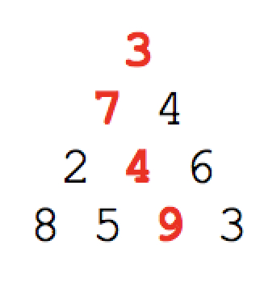
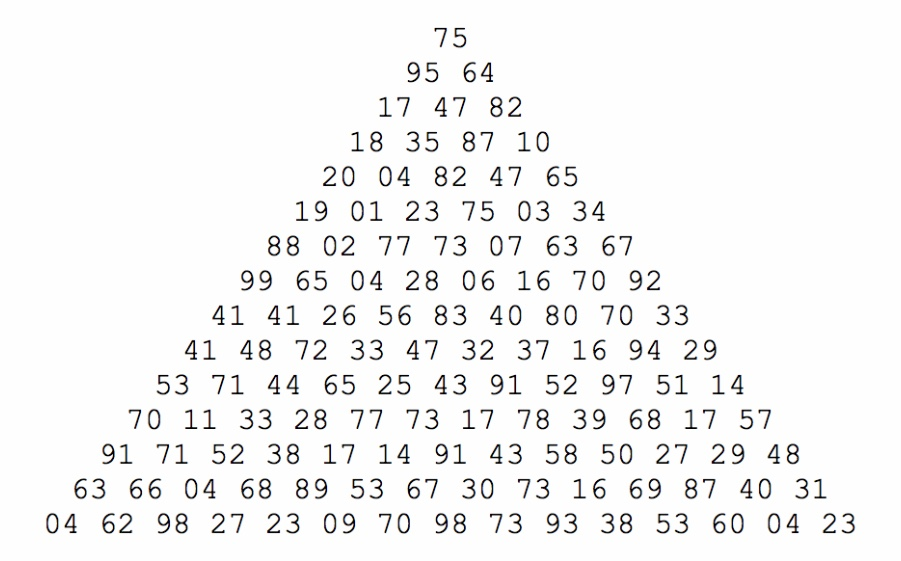

# Project Euler 🧮

## El arte de las matemáticas 🎻

En internet puedes encontrar muchas cosas, desde videos de Yuya hasta cositas matemáticas interesantes. ProjectEuler son una serie de ejercicios matemáticos para entrenarte porque al fin y al cabo, la programación no existiría sin las matemáticas. **(Disponible en Netflix: The Imitation Game (El código enigma)🍿)**

###  Los retos ejemplo:

#### Suma de primos 🧸

La suma de los primos menores que 10:
	
 
	
Encuentre la suma de todos los primos menores que 2 millones. ¿Suena mucho no?

La solución podemos verla como la siguiente:

```swift
var numbers = Dictionary<Int,Bool>()

for i in  2...20000 { //Guardamos en un arreglo de tamaño 2,000,000 banderas, pero como no quiero ver mi computadora morir, lo dejamos en 20000
    numbers[i] = true
}
var max =  Int ( sqrt(Double(numbers.count)) ) //Obtenemos la raíz de la cantidad de números **

for i in numbers.keys.sorted().min()!...max {
    if numbers[i] == true {
        var j = i * i
        while(j <= numbers.count + 1) {
            numbers[j] = false
            j += i
        }
    }
}

var sum:IntMax = 0
s
for i in numbers.keys {
	if(numbers[i] == true) {
       sum += i
  	}
}

print(sum)

```

Ténganse en cuenta que la complejidad computacional de éste problema es alta (Tiempo que dura a mayor cantidad de números). Así que si logran bajarla les regalo un Totti. 🥠

#### La suma de los caminos 🏔

Iniciando en la punta del triángulo y moviéndose hacia el número adyacente más grande, la suma total de punta a base de éstos números es 23.



 


Ahora, hay que realizar un algoritmo para el siguiente triángulo:



```swift
let levels: [[Int]] = [
    [04, 62, 98, 27, 23, 09, 70, 98, 73, 93, 38, 53, 60, 04, 23],
      [63, 66, 04, 68, 89, 53, 67, 30, 73, 16, 69, 87, 40, 31],
        [91, 71, 52, 38, 17, 14, 91, 43, 58, 50, 27, 29, 48],
          [70, 11, 33, 28, 77, 73, 17, 78, 39, 68, 17, 57],
            [53, 71, 44, 65, 25, 43, 91, 52, 97, 51, 14],
              [41, 48, 72, 33, 47, 32, 37, 16, 94, 29],
                [41, 41, 26, 56, 83, 40, 80, 70, 33],
                  [99, 65, 04, 28, 06, 16, 70, 92],
                    [88, 02, 77, 73, 07, 63, 67],
                      [19, 01, 23, 75, 03, 34],
                        [20, 04, 82, 47, 65],
                          [18, 35, 87, 10],
                            [17, 47, 82],
                              [95, 64],
                                [75]]

func p18() -> Int {
    var lastLevelScores = levels[0]
    for level in levels[1..<levels.count] {
        var levelScores: [Int] = []
        for i in 0..<level.count{
            let betterPathScore = max(lastLevelScores[i], lastLevelScores[i + 1])
            levelScores.append(level[i] + betterPathScore)
        }
        lastLevelScores = levelScores
    }

    return lastLevelScores[0]
}
p18()

```
El resultado del algoritmo: **1074**

#### La suma de los caminos 🏔


###  Retos a resolver: