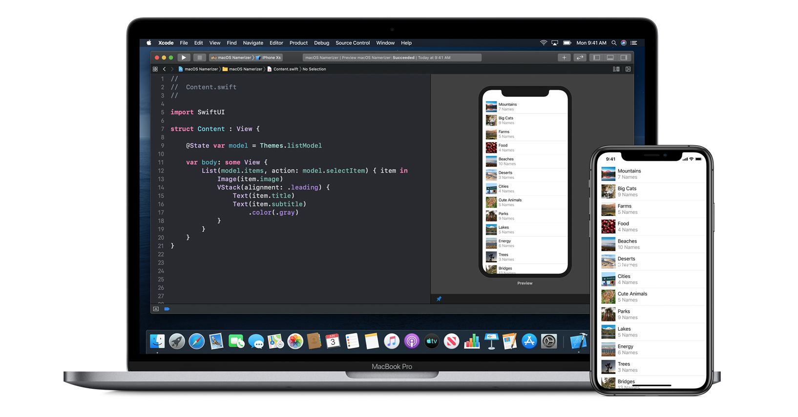
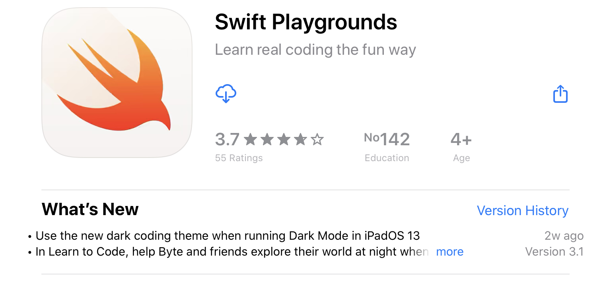
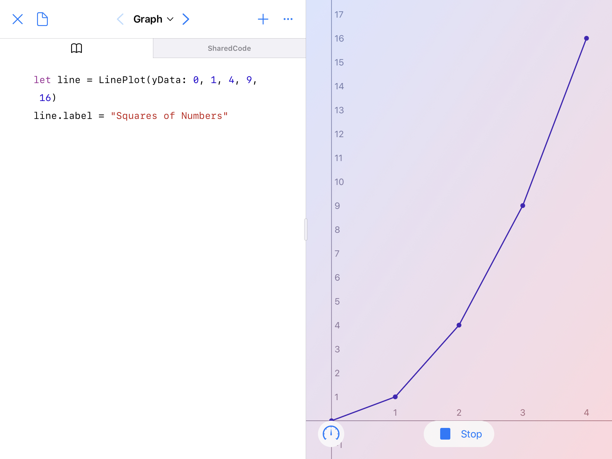
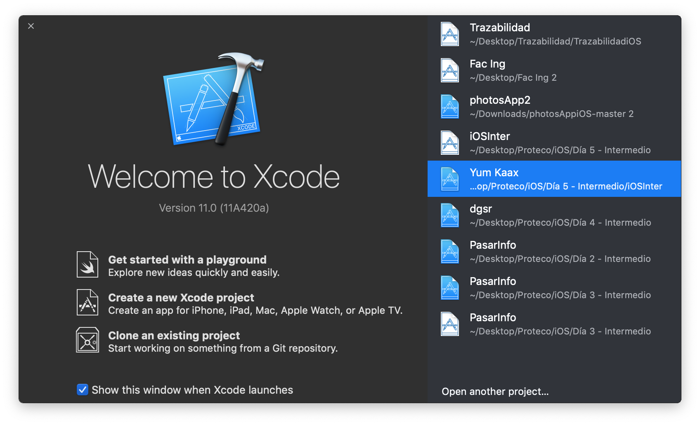
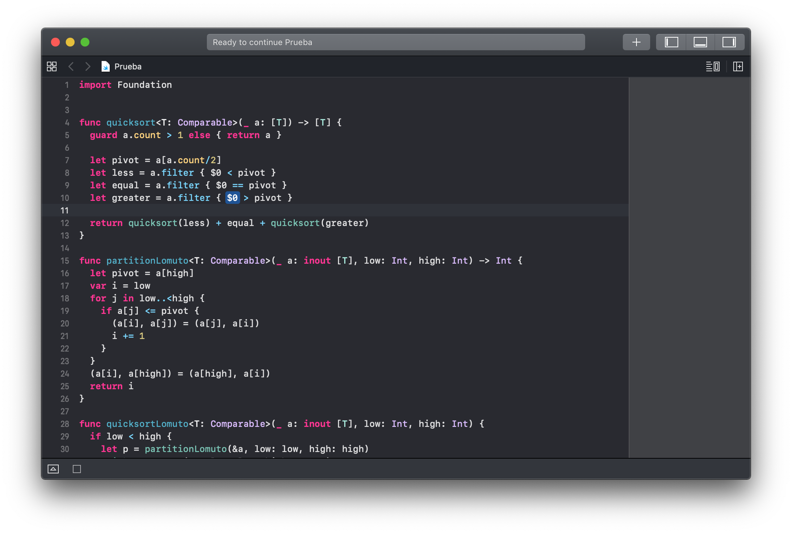

# Algoritmos de refuerzo 🥋

#### Para mejorar tu experiencia en el curso estará a tu disposición éstos algoritmos que deberás resolver y contarán como 2 puntos extra sobre calificación. Antes viene una breve teoría y luego los ejercicios que deberás entregar.

Te recomendamos pensarlos de una manera creativa, ya que te ayudará mejorar la forma en que programas cualquier lenguaje.



Para poder trabajar en estos ejercicios no es necesario contar con un equipo Mac. Posees las siguientes opciones:

### Ubutu 18.04 - 16.04 - 14.04 🖥

Si tienes instalado la distribución de GNU/Linux Ubuntu puedes instalarlo siguiendo las siguientes instrucciones:

Descarga el paquete de la siguiente página:

[Swift Ubuntu 18.04, 16.04, 14.04](https://swift.org/download/#releases) 

Luego de descargarlo, dirígete a la localización del archivo .tar.gz

```console
TuComputadora:~$ tar -xvzf swift-2.2-SNAPSHOT*
TuComputadora:~$ cd swift-2.2-SNAPSHOT*
TuComputadora:~$ sudo apt-get install clang libicu-dev
TuComputadora:~$ swift -version
```
Para mayor información dentro del curso intersemestral se asesorará para la instalación en Ubuntu.

### iPad 📱

Dentro de la App Store existe la aplicación Swift Playgrounds



Para poder crear los programas es necesario tener una hoja en blanco. Además puedes interactuar con los retos de aprendizaje que la misma aplicación ofrece.



### Mac 💻

Si tienes la fortuna de contar con un equipo Mac para poder realizar los programas deberás crear un nuevo proyecto de playground. ("Get started with a playground")



Deberás poner hoja en blanco, elegir una ubicación para guardarlo y empezar a hacer tus programas.




### ¡Y listo! ¡Qué te diviertas! ⭐️
